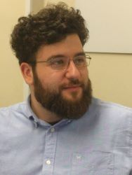

# About me
Hello! I'm Nicolò Renzoni, but I go by the name KlausRenzo pretty much everywhere on the internet.  
I'm currently working as a software developer for Te.Si.Fer. srl, a railway engineering company located in Florence (IT), primarily using C# .NET framework. I'm also studying to finish my bachelor degree in computer engineering at the University of Florence.  
Alongside my daytime job, I also develop games using the Unity engine and I have partecipated in some game jams, were most of the public projects I have linked below were developed.  
In september 2020 I completed the course of Game Programming at TheSIGN - comics and arts academy.

# Skills
+ C# developing on the .Net platform: .NET framework, ASP.NET and .NET core.
+ Unity engine
+ Thinkering with Docker and Azure platform

# Pubblications
+ September 2019: *Integrating Thermographic Images in A User-Friendly Platform to Support Inspection of Railway Bridges* - [[Abstract](https://www.mdpi.com/2504-3900/27/1/12)]

# Projects
## Game Jams
+ [TheSIGN Jam 2020](https://github.com/KlausRenzo/TSjam2020)
+ [Move 'em All](https://github.com/KlausRenzo/Move-Them-All) - Pisa Internet Festival 2019 game jam
+ [Planet Hopping](https://github.com/KlausRenzo/Planet-Hopping) - Global Game Jam 2019
+ [For Valhalla](https://github.com/KlausRenzo/For-Valhalla) - Pisa Internet Festival 2017 game jam

# Links
+ [Linkedin.com](https://www.linkedin.com/in/nicolo-renzoni/)
+ [Twitter.com](https://twitter.com/KlausRenzo)
